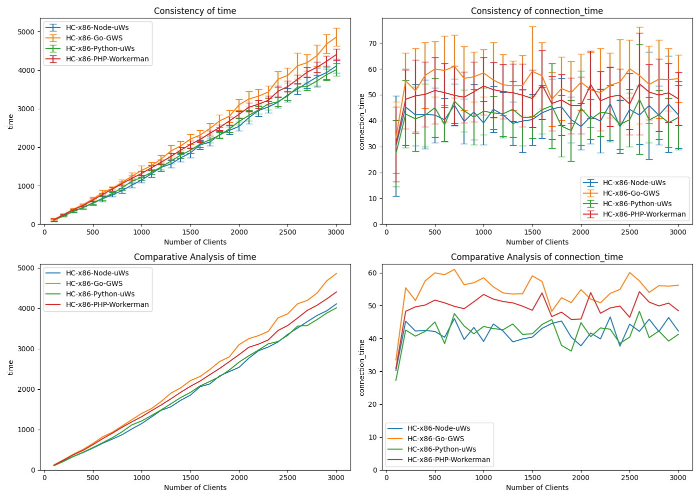

# Websocket Benchmark Client (Docker)

Based on [NodeJS Websocket Benchmark Client](https://github.com/matttomasetti/NodeJS_Websocket-Benchmark-Client) repository, and
[Websocket Performance Comparison](https://matttomasetti.medium.com/websocket-performance-comparison-10dc89367055).

This is a NodeJS websocket client designed to benchmark the performance of both reliability and speed of various websocket implementations.

## Install & run

Prepare `.env` file (example provided).

```bash
docker build . -t websocket_benchmark/client && \
docker run --rm --network="host" -v ./benchmarks:/home/client/benchmarks --env-file ./.env websocket_benchmark/client
```

or run the script, which builds and runs the container, and prompts you essential parameters:

```bash
./start.sh
```

## Results

Tested on a Hetzner Cloud server instance CPX11 (2 vCPU x86 AMD EPYC™️ 7002 series, 2 GB RAM) scoring 976 points in [Geekbench 5 Single-Core test](https://browser.geekbench.com/v5/cpu/22659970) (tests run using Docker containers).



This particular test was run on localhost using these settings:

| Parameter | Value |
| --- | --- |
| Number of test repetitions | 20 |
| Number of rounds per repetition | 30 |
| Connections to be added per round | 100 |
| Requests each connection makes per round | 100 |

So the test is started with 100 connections sending 10k requests in total and ended up with 3000 connections sending 300k in total per round, and was repeated 20 times.

The server instance had 2 containers running simultaneously: this client and a server variation (Node, Go, etc.).

This chart contains only "fast" implementations of websocket server for each language. If there were more than one implementation per language, see the comparison inside linked repositories.

## Conclusions

The difference is there, but it's not that significant compared to other implementations that did not make it to this chart.
uWebSockets is really good regardless of the language. It's not available for PHP. Besides, someone should try to implement it for Go (it's not my cup of tea).

## Report generated by

*Repository to be created and linked.*

## Websocket servers

* [Node](https://github.com/wiz00/Websocket-Benchmark-Node)
* [Python](https://github.com/wiz00/Websocket-Benchmark-Python)
* [PHP](https://github.com/wiz00/Websocket-Benchmark-PHP)
* [Go](https://github.com/wiz00/Websocket-Benchmark-Go)

## Original comparison

* [Websocket Performance Comparison](https://matttomasetti.medium.com/websocket-performance-comparison-10dc89367055)
* [Technical Report](https://www.researchgate.net/publication/348993267_An_Analysis_of_the_Performance_of_Websockets_in_Various_Programming_Languages_and_Libraries)

## Original GitHub repositories

* [Benchmarking Client (NodeJS)](https://github.com/matttomasetti/NodeJS_Websocket-Benchmark-Client)
* [C (LWS)](https://github.com/matttomasetti/C-LWS_Websocket-Benchmark-Server)
* [C++ (uWS)](https://github.com/matttomasetti/CPP-uWS_Websocket-Benchmark-Server)
* [C# (Fleck)](https://github.com/matttomasetti/CS-Fleck_Websocket-Benchmark-Server)
* [Go (Gorilla)](https://github.com/matttomasetti/Go-Gorilla_Websocket-Benchmark-Server)
* [Java (WebSocket)](https://github.com/matttomasetti/Java-WebSocket_Websocket-Benchmark-Server)
* [NodeJS (uWS)](https://github.com/matttomasetti/NodeJS-uWS_Websocket-Benchmark-Server)
* [PHP (Ratchet)](https://github.com/matttomasetti/PHP-Ratchet_Websocket-Benchmark-Server)
* [Python (Websockets)](https://github.com/matttomasetti/Python-Websockets_Websocket-Benchmark-Server)
* [Python (Autobahn)](https://github.com/matttomasetti/Python-Autobahn_Websocket-Benchmark-Server)
* [Python (Aiohttp)](https://github.com/matttomasetti/Python-Aiohttp_Websocket-Benchmark-Server)
* [Rust (WebSocket)](https://github.com/matttomasetti/Rust-WebSocket_Websocket-Benchmark-Server)
